<!-- markdownlint-disable MD033 MD041 -->

  

<!-- Contact Badges -->

  

<!-- GitHub Stats -->
<table align="center" style="border: none; background: transparent;">
  <tr>
    <td align="center" width="50%">
      
    </td>
    <td align="center" width="50%">
      
    </td>
  </tr>
</table>

<!-- Snake Animation -->
<picture>
  <source media="(prefers-color-scheme: dark)" srcset="https://raw.githubusercontent.com/Nexlein/Nexlein/output/github-contribution-grid-snake-dark.svg">
  <source media="(prefers-color-scheme: light)" srcset="https://raw.githubusercontent.com/Nexlein/Nexlein/output/github-contribution-grid-snake.svg">
  
</picture>

  

<!-- Support -->

